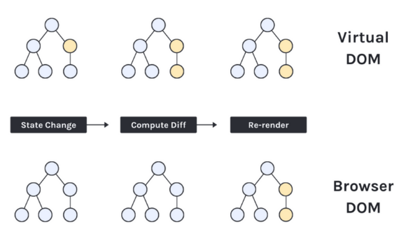
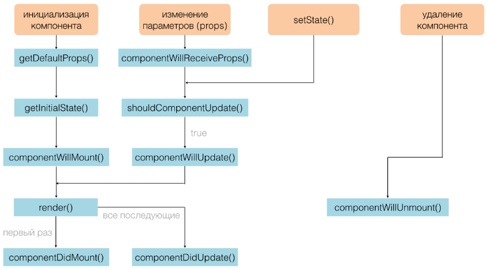
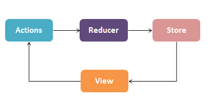

# React-interview

<a id="0"/></a>
JSX  
[1. Что такое JSX?](#1)  
[2. Можно ли использовать React без JSX?](#2)  

React DOM  
[3. Что такое виртуальный DOM?](#3)  
[4. Является ли виртуальный DOM таким же, как теневой DOM?](#4)  
[5. В чем разница между виртуальным DOM и реальным DOM?](#5)  

Render  
[6. Когда рендерится компонент?](#6)  
[7. Как не рендерить при изменении props?](#7)  
[8. Можно ли использовать стрелочные функции в методе render()?](#8)  

Взаимодействие между компонентами  
[9. Как передать значение от родителя к дочернему?](#9)  
[10. Как передать значение от дочернего к родительскому?](#10)  
[11. Что такое prop drilling (передача пропсов)?](#11)  
[12. Может ли дочерний компонент изменять свои props?](#12)  
[13. Rак передать значения между соседними компонентами (siblings)?](#13)  

Lifecycle and State  
[14. В чем разница между props и state?](#14)  
[15. Чем состояние компонента класса отличается от состояния функционального компонента?](#15)  
[16. Что такое жизненный цикл компонента?](#16)  
[17. Как обновить жизненный цикл в функциональных компонентах?](#17)  

Ref  
[18. В чем разница между ссылками (ref) и переменными состояния (state variables)?](#18)  
[19. Когда лучше всего использовать refs?](#19)  
[20. Как правильно обновить ссылку в функциональном компоненте?](#20)  

Context  
[21. В чем разница между context API and prop drilling?](#21)  
[22. Когда не следует использовать context API?](#22)  

Redux  
[23. Базовые принципы Redux](#23)  
[24. Каков типичный поток данных (Data Flow) в приложении React + Redux?](#24)  
[25. Преимущества Redux](#25)  

Other  
[26. Это хорошая идея - использовать Math.random для ключей?](#26)  
[27. Каковы ограничения React?](#27)  
[28. Компонент (функция) высшего порядка (HOC)](#28)  
[29. Управляемые и неуправляемые компоненты](#29)  
[30. Оптимизация React](#30)  

***

<a id="1"/></a>
## 1. Что такое JSX?

**JSX** - это расширение синтаксиса JavaScript, которое позволяет использовать XML-подобный синтаксис для описания структуры пользовательского интерфейса в React. JSX позволяет разработчикам создавать компоненты React, которые могут содержать HTML-подобные теги, атрибуты и дочерние элементы. JSX затем компилируется в обычный JavaScript, который может быть выполнен в браузере. 

**JSX** понимается только препроцессорами, такими как Babel. Когда препроцессор обрабатывает этот текст, похожий на HTML, он преобразуется в обычные функциональные вызовы React.createElement.

> JSX не является частью спецификации ECMAScript, и поэтому ни один веб-браузер не понимает JSX.
JSX - это синтаксический сахар для функции React.createElement.

Вот пример использования JSX в React:

```js
import React from 'react';

function MyComponent() {
  return (
    <div className="my-class">
      <h1>Hello, World!</h1>
      <p>This is my first React component.</p>
    </div>
  );
}
```

В этом примере мы создаем компонент MyComponent, который возвращает JSX-элемент, содержащий теги div, h1 и p. Обратите внимание, что мы используем атрибут className вместо class, потому что class является зарезервированным словом в JavaScript.

[вернуться к списку вопросов](#0)
***

<a id="2"/></a>
## 2. Можно ли использовать React без JSX?

Да, можно использовать React без JSX. JSX - это просто синтаксический сахар, который упрощает написание кода React, но не является обязательным для использования React. Вместо JSX вы можете использовать обычный JavaScript для создания элементов React.

> JSX - это синтаксический сахар для функции React.createElement. React.createElement является частью общедоступного API верхнего уровня React, так же как React.component или React.useRef.

Например, вместо написания:
```js
const element = <h1>Hello, world!</h1>;

// Вы можете написать:

const element = React.createElement('h1', null, 'Hello, world!');
```

Обратите внимание, что React.createElement() возвращает объект React-элемента, который затем может быть отрендерен в DOM.

[вернуться к списку вопросов](#0)
***
<a id="3"/></a>
## 3. Что такое виртуальный DOM? Как React использует виртуальный DOM для рендеринга пользовательского интерфейса?
> Объектная модель документа (Document Object Model, DOM) - это стандартная модель программирования, используемая для представления и взаимодействия с HTML-документами, XML-документами и другими типами документов. DOM представляет документ в виде дерева объектов, где каждый элемент документа является объектом. DOM простыми словами представляет собой пользовательский интерфейс приложения.

> Виртуальный DOM — это виртуальное представление реального DOM.

**Виртуальный DOM (VDOM)** - это концепция, которая используется во многих библиотеках и фреймворках JavaScript, включая React. Он представляет собой абстрактное представление реального DOM, которое хранится в памяти и используется для оптимизации процесса рендеринга.

Когда React обновляет пользовательский интерфейс, он сначала создает новое дерево виртуального DOM на основе изменений в состоянии приложения или свойствах компонентов. Затем React сравнивает новое дерево виртуального DOM с предыдущим деревом и определяет, какие элементы были изменены, добавлены или удалены.

После того, как React определил, какие элементы должны быть обновлены, он создает новый дерево реального DOM и обновляет только те элементы, которые были изменены. Это позволяет избежать необходимости полного перерисовывания всего пользовательского интерфейса и ускоряет процесс рендеринга.

Использование виртуального DOM также позволяет React работать с различными браузерами и платформами, не завися от конкретной реализации реального DOM. Это делает React более переносимым и удобным для разработки кросс-браузерных приложений.

В целом, использование виртуального DOM является одним из ключевых преимуществ React и позволяет создавать быстрые и эффективные пользовательские интерфейсы.

[вернуться к списку вопросов](#0)
***
<a id="4"/></a>
## 4. Является ли виртуальный DOM таким же, как теневой DOM?

**Виртуальный DOM (virtual DOM, VDOM)** - это концепция, используемая в библиотеках и фреймворках, таких как React и Vue, для оптимизации производительности при обновлении пользовательского интерфейса. Виртуальный DOM представляет собой виртуальное дерево элементов, которое React или Vue используют для определения того, какие элементы должны быть обновлены при изменении состояния приложения. Виртуальный DOM позволяет избежать ненужных обновлений и повысить производительность приложения.

**Теневой DOM (shadow DOM)** - это концепция, используемая в браузерах для реализации веб-компонентов. Теневой DOM представляет собой отдельное дерево элементов, которое используется для изоляции стилей и поведения веб-компонента от остальной части страницы. Теневой DOM позволяет создавать компоненты, которые могут быть использованы в разных частях страницы, не влияя на другие элементы на странице.

Таким образом, виртуальный DOM и теневой DOM - это разные концепции, используемые для разных целей.

[вернуться к списку вопросов](#0)
***
<a id="5"/></a>
## 5. В чем разница между виртуальным DOM и реальным DOM?

**Виртуальный DOM (VDOM)** - это концепция, которая используется в библиотеках и фреймворках JavaScript, таких как React и Vue, для ускорения процесса обновления пользовательского интерфейса. Вместо того, чтобы изменять реальный DOM напрямую, библиотеки создают виртуальное представление дерева DOM, которое хранится в памяти. Когда происходят изменения в состоянии приложения, библиотека сравнивает виртуальное дерево с предыдущей версией и определяет, какие элементы необходимо обновить. Затем библиотека обновляет только те элементы, которые изменились, в реальном DOM.

**Реальный DOM** - это фактическое представление дерева DOM, которое браузер создает на основе HTML-кода. Когда происходят изменения в состоянии приложения, библиотеки обновляют реальный DOM, чтобы отобразить эти изменения. Однако обновление реального DOM может быть очень медленным, особенно если в дереве DOM много элементов. Кроме того, обновление реального DOM может привести к перерисовке всего дерева, даже если изменения затрагивают только небольшую часть дерева.

Виртуальный DOM позволяет избежать этих проблем, поскольку он позволяет библиотекам эффективно обновлять только те элементы, которые изменились, и не перерисовывать всё дерево. Это делает обновление пользовательского интерфейса более быстрым и эффективным.

<p align="center">
  
</p>

[вернуться к списку вопросов](#0)
***
<a id="6"></a>
## 6. Когда рендерится компонент?
Компонент рендерится, когда он вставляется в DOM. Это происходит, когда компонент впервые отображается на странице или когда его состояние или свойства изменяются. Когда компонент рендерится, React создает виртуальное представление дерева DOM, которое затем сравнивается с предыдущей версией, чтобы определить, какие элементы необходимо обновить. Затем React обновляет только те элементы, которые изменились, в реальном DOM.

Компонент может быть перерендерен множество раз во время жизненного цикла приложения, например, когда его состояние или свойства изменяются, или когда он получает новые данные из API. При этом React будет создавать новое виртуальное представление дерева DOM и сравнивать его с предыдущей версией, чтобы определить, какие элементы необходимо обновить. Если изменения затрагивают только небольшую часть дерева, то React обновит только эту часть, что делает обновление пользовательского интерфейса более быстрым и эффективным.

[вернуться к списку вопросов](#0)
***
<a id="7"></a>
## 7. Как не рендерить при изменении props?
> Использовать метод жизненного цикла **shouldComponentUpdate()**

Этот метод вызывается перед каждым обновлением компонента и позволяет определить, должен ли компонент быть перерендерен или нет.

В методе shouldComponentUpdate() вы можете сравнить текущие свойства (props) компонента с предыдущими свойствами и вернуть false, если свойства не изменились и компонент не должен быть перерендерен. Если свойства изменились, вы можете вернуть true, чтобы разрешить перерендеринг компонента.

Вот пример использования метода shouldComponentUpdate() для предотвращения перерендеривания компонента при изменении определенных свойств:
```js
class MyComponent extends React.Component {
  shouldComponentUpdate(nextProps) {
    if (nextProps.prop1 === this.props.prop1 && nextProps.prop2 === this.props.prop2) {
      return false; // не перерендеривать компонент, если prop1 и prop2 не изменились
    }
    return true; // перерендеривать компонент, если prop1 или prop2 изменились
  }

  render() {
    // рендеринг компонента
  }
}
```
Обратите внимание, что метод shouldComponentUpdate() может повлиять на производительность приложения, поэтому его следует использовать с осторожностью и только там, где это необходимо.

> Как я могу реализовать shouldComponentUpdate? Вы можете обернуть функциональный компонент в вызов **React.memo** для поверхностного сравнения его пропсов:
```js
const Button = React.memo((props) => {
  // ваш компонент
});
```
Эта функция не является хуком, так как она не ведёт себя как хук. React.memo аналогична PureComponent, но она сравнивает только пропсы. (Вы также можете добавить второй аргумент, чтобы определить свою функцию сравнения, которая примет старые и новые пропсы. Если эта функция вернёт true, обновление будет пропущено.)

React.memo не сравнивает состояние, потому что не существует единого объекта, который можно сравнить. Но вы можете также сделать дочерние компоненты чистыми или даже оптимизировать определённые дочерние компоненты, используя хук useMemo.

[вернуться к списку вопросов](#0)
***

<a id="8"></a>
## 8. Можно ли использовать стрелочные функции в методе render()?

В целом, да. Зачастую это самый простой способ передать параметры через колбэки.
Однако, если вы используете стрелочную функцию в качестве метода класса, то контекст this будет ссылаться на объект, в котором определена функция, а не на экземпляр класса. Это может привести к ошибкам, если вы пытаетесь обратиться к свойствам или методам экземпляра класса. Чтобы избежать этой проблемы, вы можете использовать обычные функции вместо стрелочных функций в методах класса.

[вернуться к списку вопросов](#0)
***

<a id="9"></a>
## 9. Как передать значение от родителя к дочернему?

Вы можете передать значение от родительского компонента к дочернему компоненту в React, используя пропсы (props). 
> props (пропсы) — это входные данные React-компонентов, передаваемые от родительского компонента дочернему компоненту.

Помните, props предназначены только для чтения. Ни в каком случае их не следует изменять.

```js
// Родительский компонент
function ParentComponent() {
  const value = "Hello, world!";

  return (
    <ChildComponent message={value} />
  );
}

// Дочерний компонент
function ChildComponent(props) {
  return (
    <div>{props.message}</div>
  );
}
```

В этом примере мы определяем переменную value в родительском компоненте и передаем ее значение в дочерний компонент через атрибут message. В дочернем компоненте мы выводим значение пропса message внутри элемента div.

Вы также можете передавать функции в качестве пропсов, чтобы дочерний компонент мог вызывать их для обновления состояния родительского компонента.

[вернуться к списку вопросов](#0)
***

<a id="10"></a>
## 10. Как передать значение от дочернего к родительскому?

Чтобы передать значение от дочернего компонента к родительскому компоненту в React, вы можете использовать **колбэки**.

Для передачи значения от дочернего компонента к родительскому компоненту, вы можете определить колбэк в родительском компоненте и передать его в дочерний компонент через пропсы. В дочернем компоненте вы можете вызвать этот колбэк с передачей значения в качестве аргумента. 

Например:
```js
// Родительский компонент
function ParentComponent() {
  const [value, setValue] = useState("");

  function handleChildValue(newValue) {
    setValue(newValue);
  }

  return (
    <div>
      <ChildComponent onValueChange={handleChildValue} />
      <p>Value from child: {value}</p>
    </div>
  );
}

// Дочерний компонент
function ChildComponent(props) {
  function handleChange(event) {
    props.onValueChange(event.target.value);
  }

  return (
    <input type="text" onChange={handleChange} />
  );
}
```
В этом примере мы определяем состояние value в родительском компоненте и передаем колбэк handleChildValue в дочерний компонент через пропс onValueChange. В дочернем компоненте мы определяем функцию handleChange, которая вызывает колбэк onValueChange с передачей значения из поля ввода в качестве аргумента. Когда значение изменяется в дочернем компоненте, вызывается колбэк handleChildValue в родительском компоненте, который обновляет состояние value.

[вернуться к списку вопросов](#0)
***

<a id="11"></a>
## 11. Что такое prop drilling (передача пропсов, "сверление")?

> "Prop drilling" - это процесс передачи пропсов (props) через несколько уровней вложенных компонентов в React (более чем на два). 

Когда компоненты находятся на разных уровнях вложенности, и один компонент должен передать данные другому компоненту, который находится глубоко внутри дерева компонентов, то необходимо передавать пропсы через все промежуточные компоненты, что может привести к "prop drilling".

"Prop drilling" может быть проблемой, когда приложение становится сложным и имеет множество вложенных компонентов. В таких случаях передача пропсов через множество уровней может стать неудобной и привести к ошибкам. Для решения этой проблемы можно использовать более продвинутые методы передачи данных, такие как контекст (context) или Redux.

[вернуться к списку вопросов](#0)
***

<a id="12"></a>
## 12. Может ли дочерний компонент изменять свои props?

Нет, дочерний компонент не может изменять свои пропсы (props) напрямую. В React пропсы являются неизменяемыми (immutable) и только родительский компонент может изменять свои пропсы и передавать их дочерним компонентам.

Однако, если дочерний компонент должен изменять какие-то данные, которые были переданы ему через пропсы, то родительский компонент может передать функцию обратного вызова (callback function) в качестве пропса, которая будет вызываться в дочернем компоненте для изменения данных. Таким образом, дочерний компонент может изменять данные, но только через вызов функции обратного вызова, которая была передана ему через пропсы.

[вернуться к списку вопросов](#0)
***

<a id="13"></a>
## 13. Как передать значения между соседними компонентами (siblings)?

В React данные передаются вниз по иерархии компонентов, от родительского компонента к дочерним компонентам через пропсы (props). Если два компонента являются соседними (siblings) и не имеют общего родительского компонента, то можно использовать подход "поднятия состояния вверх" (lifting state up).

Поднятие состояния вверх - это процесс перемещения состояния из дочернего компонента в родительский компонент, чтобы обеспечить доступ к этому состоянию другим дочерним компонентам. Для этого необходимо определить состояние в родительском компоненте и передавать его в качестве пропса в дочерние компоненты. Если два соседних компонента должны иметь доступ к одному и тому же состоянию, то это состояние должно быть определено в их общем родительском компоненте.

[вернуться к списку вопросов](#0)
***

<a id="14"></a>
## 14. В чем разница между props и state?

В React props и state используются для управления данными и поведением компонентов.

> Props (сокращение от properties) - это объекты, которые передаются в компоненты в качестве атрибутов. Они используются для передачи данных от родительского компонента к дочернему компоненту. Props являются неизменяемыми и доступны только для чтения в компоненте, в котором они были переданы.

> State - это объект, который содержит данные, управляющие поведением компонента. State может изменяться внутри компонента и обновляться с помощью метода setState(). Когда state изменяется, React перерисовывает компонент, чтобы отобразить новое состояние.

Основная разница между props и state заключается в том, что props передаются в компонент извне, а state управляется самим компонентом. Props используются для передачи данных от родительского компонента к дочернему компоненту, а state используется для управления поведением компонента внутри него.

[вернуться к списку вопросов](#0)
***

<a id="15"></a>
## 15. Чем состояние компонента класса отличается от состояния функционального компонента?
Состояние компонента класса и состояние функционального компонента в React работают по-разному.

> В компонентах класса состояние хранится в свойстве state, которое является объектом, содержащим данные, управляющие поведением компонента. Состояние может быть изменено с помощью метода setState(), который вызывает перерисовку компонента с новым состоянием. Компоненты класса также могут иметь методы жизненного цикла, которые позволяют выполнять дополнительные действия при монтировании, обновлении или размонтировании компонента.

> В функциональных компонентах состояние хранится в переменной, объявленной с помощью хука useState. Хук useState возвращает массив, содержащий текущее состояние и функцию для его обновления. При вызове функции обновления состояния компонент перерисовывается с новым состоянием. Функциональные компоненты также могут использовать другие хуки, такие как useEffect, useContext и useReducer, для управления поведением компонента.

Основное отличие между состоянием компонента класса и состоянием функционального компонента заключается в том, что компоненты класса имеют больше возможностей для управления состоянием и жизненным циклом компонента, в то время как функциональные компоненты более просты и легче для понимания и написания. Кроме того, функциональные компоненты могут использовать хуки, которые предоставляют более гибкий и удобный способ управления состоянием и поведением компонента.

[вернуться к списку вопросов](#0)
***

<a id="16"></a>
## 16. Что такое жизненный цикл компонента?

> Жизненный цикл компонента React - это последовательность этапов, которые проходит компонент при создании, обновлении и удалении в React-приложении. 

Жизненный цикл компонента React состоит из следующих методов:

1. **Методы монтирования (Mounting methods)**. Эти методы вызывают в следующем порядке, когда экземпляр компонента создаётся и добавляется в DOM:
- `constructor()` - вызывается при создании компонента и используется для инициализации состояния и привязки методов;
- `static getDerivedStateFromProps()` - вызывается перед render() и используется для обновления состояния на основе новых свойств;
- `render()` - вызывается для отображения компонента на экране;
- `componentDidMount()` - вызывается после того, как компонент был добавлен на страницу.

2. **Методы обновления (Updating methods)**. Обновление может быть вызвано изменениями в свойствах или состоянии. Эти методы вызываются в следующем порядке, когда компонент повторно отрисовывается:
- `static getDerivedStateFromProps()` - вызывается перед render() и используется для обновления состояния на основе новых свойств;
- `shouldComponentUpdate()` - вызывается перед обновлением компонента и используется для оптимизации производительности;
- `render()` - вызывается для отображения компонента на экране;
- `componentDidUpdate()` - вызывается после обновления компонента.

3. **Метод размонтирования (Unmounting method)**. Этот метод вызывается, когда компонент удаляется из DOM:
- `componentWillUnmount()` - вызывается перед удалением компонента и используется для отмены подписок на события и очистки ресурсов.

4. **Методы ошибок (Error methods)**:
- `static getDerivedStateFromError()` - вызывается при возникновении ошибки в дочернем компоненте и используется для обновления состояния родительского компонента;
- `componentDidCatch()` - вызывается при возникновении ошибки в дочернем компоненте и используется для логирования ошибок.

<p align="center">
  
</p>

> В React есть несколько методов жизненного цикла, которые считаются устаревшими и могут быть удалены в будущих версиях. Эти методы включают в себя:
> * `componentWillMount()` - вызывается перед тем, как компонент будет отрисован в DOM. Вместо него следует использовать методы constructor() или componentDidMount(). Метод componentWillMount() выполняется непосредственно перед рендерингом компонента как на стороне клиента, так и на стороне сервера.
> * `componentWillReceiveProps()` - вызывается при получении новых свойств компонентом. Вместо него следует использовать методы getDerivedStateFromProps() или componentDidUpdate().
> * `componentWillUpdate()` - вызывается перед обновлением компонента. Вместо него следует использовать методы getSnapshotBeforeUpdate() или componentDidUpdate().

[вернуться к списку вопросов](#0)
***

<a id="17"></a>
## 17. Как обновить жизненный цикл в функциональных компонентах?

В функциональных компонентах React можно использовать `хуки (hooks)` для управления жизненным циклом компонента. 
Хуки - это функции, которые позволяют использовать состояние и другие возможности React в функциональных компонентах.

Существует несколько хуков, которые позволяют управлять жизненным циклом компонента:

* `useEffect` - позволяет выполнять побочные эффекты (side effects) в функциональных компонентах. Побочные эффекты могут быть, например, запросы к серверу, обновление локального хранилища, подписка на события и т.д.. Этот хук вызывается после каждого рендеринга компонента и может быть использован для выполнения действий, которые необходимо выполнить при монтировании, обновлении или размонтировании компонента.

* `useState` - позволяет добавлять состояние в функциональные компоненты. Этот хук позволяет обновлять состояние компонента и перерисовывать его при изменении состояния.

* `useContext` - позволяет использовать контекст (context) в функциональных компонентах. Контекст - это механизм, который позволяет передавать данные через дерево компонентов без необходимости передавать пропсы через каждый компонент.

* `useReducer` - позволяет использовать редукторы (reducers) в функциональных компонентах. Редукторы - это функции, которые обрабатывают действия (actions) и обновляют состояние компонента.

Пример использования хука useEffect для выполнения действий при монтировании компонента:
```js
function MyComponent() {
  useEffect(() => {
    // выполнить действия при монтировании компонента
    console.log('Компонент монтирован');
  }, []);

  return (
    <div>
      <h1>Привет, мир!</h1>
    </div>
  );
}
// Функция, переданная в useEffect, будет вызвана после каждого рендеринга компонента. Передача пустого массива вторым аргументом useEffect гарантирует, что функция будет вызвана только при монтировании компонента, а не при каждом обновлении.
```

[вернуться к списку вопросов](#0)
***

<a id="18"></a>
## 18. В чем разница между ссылками (ref) и переменными состояния (state variables)?

Ссылки (ref) и переменные состояния (state variables) - это два разных механизма в React, которые используются для управления состоянием компонентов.

* `Ссылки (ref)` используются для получения доступа к DOM-элементам, созданным компонентом. Они позволяют получить ссылку на элемент и изменять его свойства и методы. Ссылки могут быть использованы для получения значения поля ввода, установки фокуса на элемент, изменения размера элемента и т.д.

* `Переменные состояния (state variables)` используются для хранения и изменения состояния компонента. Они позволяют компоненту отслеживать изменения внутреннего состояния и перерисовываться при необходимости. Переменные состояния могут быть использованы для хранения данных, таких как текст в поле ввода, выбранный элемент списка и т.д.

Таким образом, ссылки (ref) используются для доступа к DOM-элементам, а переменные состояния (state variables) используются для хранения и изменения внутреннего состояния компонента.

> И refs, и state variables позволяют сохранять значения между рендерами (re-render) компонента; однако только state variables вызывают повторный рендер.

[вернуться к списку вопросов](#0)
***

<a id="19"></a>
## 19. Когда лучше всего использовать ссылки (refs)?
`Рефы` дают возможность получить доступ к DOM-узлам или React-элементам, созданным в рендер-методе.

**Ситуации, в которых использование рефов является оправданным:**

* Управление фокусом, выделение текста или воспроизведение медиа.
* Императивный вызов анимаций.
* Интеграция со сторонними DOM-библиотеками.

Избегайте использования рефов в ситуациях, когда задачу можно решить декларативным способом.
Refs следует использовать только в тех случаях, когда другие способы не подходят. В React рекомендуется использовать состояния (state) и свойства (props) для управления компонентами, а refs использовать только в случаях, когда это необходимо. Кроме того, не следует использовать refs для изменения состояния компонента напрямую, так как это может привести к непредсказуемому поведению, может привести к созданию неуправляемого состояния, что может усложнить отладку и поддержку кода.

[вернуться к списку вопросов](#0)
***

<a id="20"></a>
## 20. Как правильно обновить ссылку в функциональном компоненте?

В функциональном компоненте в React ссылка (ref) может быть обновлена с помощью хука useRef().

Хук `useRef()` создает изменяемый объект, который может хранить любое значение, а затем возвращает его. Значение в объекте сохраняется между рендерами компонента.

Если нужно обновить ссылку, то следует вызвать useRef() и сохранить его в переменной. Затем, при необходимости, можно обновить значение ссылки, используя метод current.

Вот пример, как можно обновить ссылку в функциональном компоненте:

```js
function TextInputWithFocusButton() {
  const inputEl = useRef(null);
  const onButtonClick = () => {
    // `current` указывает на смонтированный элемент `input`
    inputEl.current.focus();
  };
  return (
    <>
      <input ref={inputEl} type="text" />
      <button onClick={onButtonClick}>Установить фокус на поле ввода</button>
    </>
  );
}
```
По сути, useRef похож на «коробку», которая может содержать изменяемое значение в своём свойстве `.current`.

Но хук useRef() полезен не только установкой атрибута с рефом. Он удобен для сохранения любого мутируемого значения, по аналогии с тем, как вы используете поля экземпляра в классах.

Это возможно, поскольку useRef() создаёт обычный JavaScript-объект. Единственная разница между useRef() и просто созданием самого объекта {current: ...} — это то, что хук useRef даст один и тот же объект с рефом при каждом рендере.

[вернуться к списку вопросов](#0)
***

<a id="21"></a>
## 21. В чем разница между context API and prop drilling?

Контекст API и передача пропсов (prop drilling) - это два способа передачи данных между компонентами в React.

`Prop drilling (передача пропсов)` - это процесс передачи данных от родительского компонента к дочернему через цепочку свойств (props). Если несколько компонентов находятся вложенными друг в друга, данные могут передаваться через несколько уровней компонентов.

Преимуществом prop drilling является простота и понятность передачи данных. Однако при наличии множества компонентов, связанных друг с другом, prop drilling может привести к неэффективности, так как необходимо использовать множество свойств для передачи данных, которые могут быть несущественными для промежуточных компонентов.

`Context API (контекст)` - это механизм, предоставляемый React для передачи данных между компонентами без использования пропсов. Контекст (context) позволяет передавать данные глобально, так что любой компонент внутри дерева компонентов может получить доступ к этим данным, необходимым для его работы. 

Context API устраняет необходимость пробрасывания данных через множество уровней компонентов и позволяет легко и быстро получать доступ к необходимым данным в любой части приложения. Однако, контекст может быть сложным в использовании и может привести к нежелательным эффектам, например, когда данные обновляются слишком часто или когда доступ к данным не контролируется.

Таким образом, основное отличие между Context API и prop drilling заключается в том, что Context API предоставляет механизм глобальной передачи данных между компонентами, а prop drilling использует передачу данных через свойства в дочерние компоненты. Выбор между этими подходами зависит от конкретных требований и структуры приложения.

[вернуться к списку вопросов](#0)
***

<a id="22"></a>
## 22. Когда не следует использовать context API?

> Основным недостатком Context API является то, что каждый раз при изменении контекста все компоненты, потребляющие значение, перерисовываются. Это может иметь негативные последствия для производительности.
> 
> Использование контекста API должно быть ограничено только теми случаями, когда это действительно необходимо для передачи данных между компонентами.(например, настройки темы).

Context API использование не рекомендуется:

1. `Когда данные не используются во многих компонентах.` Если данные нужны только в нескольких компонентах, то использование контекста может быть излишним и усложнить код.

2. `Когда данные часто меняются.` Если данные часто меняются, то использование контекста может привести к трудностям в отладке и понимании того, где и как данные были изменены.

3. `Когда данные имеют сложную структуру.` Если данные имеют сложную структуру, то использование контекста может усложнить код и сделать его менее читаемым.

4. `Когда данные должны быть доступны только в определенных условиях.` Если данные должны быть доступны только в определенных условиях, то использование контекста может привести к ошибкам и усложнить код.

5. `Когда данные должны быть доступны только в определенной части приложения.` Если данные должны быть доступны только в определенной части приложения, то использование контекста может привести к трудностям в понимании того, где и как данные используются.

[вернуться к списку вопросов](#0)
***

<a id="23"></a>
## 23. Базовые принципы Redux

Redux - это библиотека управления состоянием приложения в JavaScript. Она основана на трех основных принципах:

1. `Единый источник правды`: состояние приложения хранится в единственном объекте - хранилище (store), который является неизменяемым. Каждое изменение состояния происходит путем создания нового объекта стейта с соответствующими изменениями.

2. `Неизменяемость состояния`: состояние приложения может быть изменено только при помощи действий (actions), каждый из которых описывает изменение и содержит тип и данные, необходимые для обновления состояния.

3. `Изменения происходят через чистые функции`: функции редьюсера (reducer) используются для обновления состояния. Редьюсеры — это просто чистые функции, которые принимают предыдущее состояние и действие и возвращают следующее состояние.

Эти принципы позволяют создавать предсказуемые и легко тестируемые приложения, которые легко масштабировать и поддерживать.

[вернуться к списку вопросов](#0)
***

<a id="24"></a>
## 24. Каков типичный поток данных (Data Flow) в приложении React + Redux?

`Однонаправленный поток данных`: изменения состояния происходят только после действий (actions), которые посылаются из представления (view). Компоненты не могут напрямую изменять состояние, а только уведомлять Redux об изменениях, которые они хотят, чтобы произошли.

В приложении React + Redux типичный поток данных выглядит следующим образом:

1. Пользователь взаимодействует с компонентом (например, он может отправлять форму или нажимать кнопку).

2. Компонент отправляет действие (`action`) в Redux Store, которое описывает тип действия и данные, связанные с этим действием. Отправленные действия перехватываются и принимаются редукторами.

3. Редуктор (`reducer`) получает действие и текущее состояние из хранилища, и возвращает новый объект состояния, который заменяет текущее состояние.

4. Хранилище (`store`) обновляет состояние, и Redux использует новое состояние, чтобы обновить подписчиков (например, подписанные компоненты интерфейса пользователя, которые отображают данные из состояния).

5. Подписанные компоненты обновляются с помощью измененных данных из хранилища.

<p align="center">
  
</p>

Этот поток данных позволяет создавать предсказуемые и легко тестируемые приложения, которые легко масштабировать и поддерживать. Кроме того, использование Redux позволяет управлять состоянием приложения в едином месте, что упрощает отладку и разработку.

[вернуться к списку вопросов](#0)
***

<a id="25"></a>
## 25. Преимущества Redux

Redux имеет несколько преимуществ, которые делают его популярным инструментом для управления состоянием приложения в React:

1. Единый источник правды: Redux основывается на принципе единого источника правды, который означает, что всё состояние приложения хранится в одном объекте. Это упрощает управление состоянием и уменьшает количество возможных состояний.

2. Предсказуемость: Redux делает код более предсказуемым и понятным. Вся логика изменения состояния находится в одном месте - в редьюсерах. Это упрощает отладку и снижает возможность возникновения ошибок.

3. Переносимость: Состояние в Redux можно легко переносить между компонентами и приложениями. Это позволяет легко создавать повторно используемые и масштабируемые компоненты.

4. Независимость состояний: Redux позволяет изолировать состояние приложения от компонентов, что упрощает управление состоянием. Это делает код модульным и способствует повторному использованию кода.

5. Удобство инструментов разработки: Redux имеет довольно большую экосистему инструментов разработки, которые позволяют упростить отладку, тестирование и документирование кода.

6. Управление состоянием на сервере: Redux позволяет управлять состоянием приложения на сервере, что упрощает создание универсальных приложений, которые могут работать как на сервере, так и на клиенте.

7. Широкое сообщество: Redux имеет широкое сообщество разработчиков, которые создают множество плагинов и расширений для упрощения работы с библиотекой.

[вернуться к списку вопросов](#0)
***

<a id="26"></a>
## 26. Это хорошая идея - использовать Math.random для ключей?
Использование `Math.random()` для задания ключей на React-элементы не является хорошей практикой. 

Ключи используются для уникальной идентификации элементов при рендеринге и обновлении компонентов в React. Использование Math.random() может привести к случайному дублированию ключей, что может снизить производительность и привести к неожиданным ошибкам в приложении.

Лучше всего использовать уникальный идентификатор из данных, связанных с элементом, например, id из базы данных или другого источника данных. Если уникального идентификатора нет, можно использовать  уникальные идентификаторы, такие как uuid, nanoid или shortid. Крайний случай - индекс элемента в массиве, если порядок элементов в массиве не изменяется. 

[вернуться к списку вопросов](#0)
***

<a id="27"></a>
## 27. Каковы ограничения React?
React имеет несколько ограничений, которые могут повлиять на его использование в различных сценариях:

1. Изначально React был разработан для создания пользовательских интерфейсов, поэтому он не предоставляет многих функций, которые могут быть полезны в других областях, таких как серверное программирование или мобильная разработка.

2. React не является полноценным фреймворком, а скорее библиотекой для создания пользовательских интерфейсов. Это означает, что для создания полноценного приложения вам может потребоваться использовать дополнительные библиотеки и инструменты.

3. React может быть сложным для новичков, особенно если они не знакомы с концепциями, такими как компоненты, состояние и жизненный цикл компонентов.

4. React не предоставляет встроенного механизма для управления состоянием приложения, поэтому вам может потребоваться использовать дополнительные библиотеки, такие как Redux или MobX.

5. React может иметь проблемы с производительностью при работе с большими и сложными приложениями, особенно если не используются оптимизации, такие как мемоизация или виртуальный скроллинг.

6. React не поддерживает некоторые функции, такие как двустороннее связывание данных, которые могут быть полезны в некоторых сценариях.

7. React считается относительно тяжелой библиотекой.

[вернуться к списку вопросов](#0)
***

<a id="28"></a>
## 28. Компонент (функция) высшего порядка (HOC)
`Higher Order Component (HOC)` - это функция высшего порядка в React, которая принимает компонент и возвращает новый компонент с дополнительными свойствами или функциональностью.

HOC позволяет повторно использовать логику и функциональность между компонентами, не дублируя код. Он также может использоваться для добавления дополнительных свойств или функциональности к компонентам, таких как аутентификация, авторизация, логирование и т.д.

HOC принимает компонент в качестве аргумента и возвращает новый компонент, который может использоваться вместо исходного компонента. Новый компонент может иметь дополнительные свойства или функциональность, которые были добавлены HOC.

Например, `React.memo` - это функция высшего порядка, которая принимает компонент и возвращает новый компонент, который оборачивает исходный компонент и оптимизирует его повторное рендеринг при изменении пропсов.

Пример использования HOC может быть следующим: 
```js
function withAuth(Component) {
  return function(props) {
    const isAuthenticated = true; // Проверка аутентификации
    if (isAuthenticated) {
      return <Component {...props} />;
    } else {
      return <Redirect to="/login" />;
    }
  };
}

const MyComponent = () => {
  return <div>Защищенный компонент</div>;
};

export default withAuth(MyComponent);
```

В этом примере withAuth - это HOC, который проверяет, аутентифицирован ли пользователь, и возвращает компонент MyComponent, если пользователь аутентифицирован, или перенаправляет на страницу входа в противном случае. 

HOC - это мощный инструмент в React, который позволяет повторно использовать логику и функциональность между компонентами, что делает код более читаемым, поддерживаемым и масштабируемым.

[вернуться к списку вопросов](#0)
***

<a id="29"></a>
## 29. Управляемые и неуправляемые компоненты

В React существует два различных подхода для управления формами.

`Управляемый компонент` - это компонент, который связан со стейтом React и может быть изменен через изменение стейта. Compонент контролируется состоянием, которое управляет его поведением и отображением. Обработчики событий компонента обновляют состояние, которое затем генерирует новое отображение компонента. Управляемые компоненты позволяют React контролировать поведение элементов формы и передавать значения дальше в приложение.

`Неуправляемый компонент` работает как обычный элемент формы вне React. Когда пользователь вводит данные в поле формы (поле ввода, выпадающий список и т. д.), обновлённая информация отображается без помощи React. Однако, это также значит, что некоторые значения не могут быть применены.

В большинстве случаев вам следует использовать управляемые компоненты.

[вернуться к списку вопросов](#0)
***

<a id="30"></a>
## 30. Оптимизация React
Оптимизация React состоит в увеличении производительности приложения и уменьшении нагрузки на браузер.

Ниже приведены некоторые способы оптимизации React:

1. Делайте рендеринг только необходимых компонентов: избегайте ререндер компонентов, которые не изменили своих свойств или состояний. Используйте мемоизацию и shouldComponentUpdate() для того чтобы только те компоненты, которые действительно нуждаются в перерисовке, обновлялись при изменении данных.

2. Используйте ключи (keys) для списков: ключи помогают React отслеживать идентичность произвольных элементов в списке, что позволяет реализовать оптимизацию нескольких операций, связанных с перерендером.

3. Разбейте приложение на меньшие компоненты: разделение приложения на более мелкие компоненты помогает ускорять восприятие пользователем и уменьшает нагрузку на браузер.

4. Переносите нагрузку с браузера на сервер: рендеринг на сервере позволяет снижать время загрузки приложений и нагрузку на браузер клиента.

5. Используйте роутинг Lazy Loading (ленивая загрузка): такой подход позволяет загружать компоненты только тогда, когда они действительно нужны, что сокращает время первоначальной загрузки приложения.

6. Используйте React.memo: memoизация компонента позволяет кэшировать результат функции, чтобы избежать повторного выполнения функции, если она уже была выполнена на предыдущем рендеринге с теми же пропсами.

7. Используйте библиотеки и пакеты оптимизации: такие библиотеки, как React Profiler и Performance Devtools, могут помочь осуществлять оптимизацию и обнаруживать проблемы в приложении.

При выборе подхода к оптимизации необходимо учитывать особенности конкретного приложения и ориентироваться на его цели и требования.
